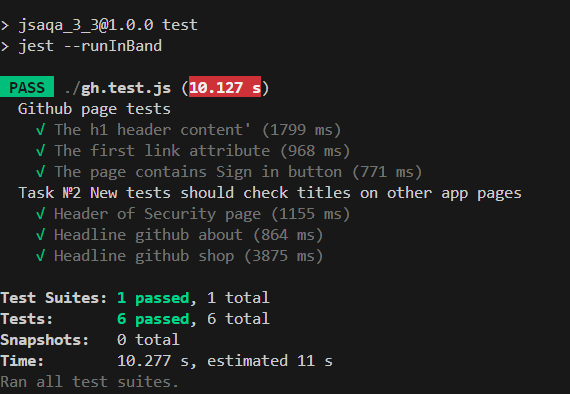

## Задача 1. Puppeteer timeout
- Сделан форк проекта с лекции.
- Уберан тайм-аут из конфигурации
- Заданы тайм-ауты для каждого из тестов в отдельности.
## Задача 2. Puppeteer before and after hooks
- Добавлены ещё три теста к существующим и помещены за блоком describe. 
  *Новые тесты должны проверять заголовки на других страницах приложения.
- Преобразован код так, чтобы всё работало, и соблюдался принцип DRY (Don't Repeat Yourself).

